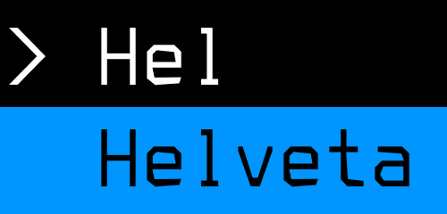
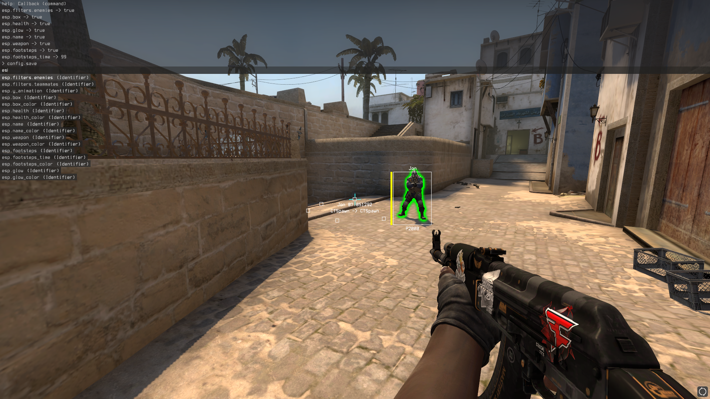

    </img>

  

	<b>Counter-Strike: Global Offensive feature-rich cheat/base written in C++20</b>
     
	<b2>Software is subject to change. This picture is from the 2nd of September, 2021</b2>
	 
    </img>
	 
	 

# Features
- **Console** - Control center of the cheat. Abilities explained in the detail section.
- **[NOT DONE!] Info bar** - Bound user information with conditions. Like i3-status. Not ready.
- **Safe rendering** - Ability to dispatch draw calls in according queues from any thread, concurrently and safely.
- **Entity Cacher** - Walkable list of all entities.
- **ESP** - Visual information on entities. Abilities explained in the detail section.
- **Misc** - Example features. Mentioned in the details section.
- **Easy NetVars** - Easy way to access game NetVars. **Table where a NetVar getter method is written is relevant (!)**. Abilities explained in the detail section.
- **Smart Memory Scanning** - Abilities explained in the detail section.
- **Compile-time, independent utilities** - Abilities explained in the detail section.
- **GameOverlayRenderer Hooking**

*	Console
	* **Easy compile-time customization!** Currently, the console customization details are constexpr, but modifiable per 	build. You can find the values at the top of Console.cc.
	* Callbacks with return state, context access and identifiers,	
	* Simple syntax (**bool** 0/1 ; **int** -INT_MAX, INT_MAX ; **color** 00000000-FFFFFFFF),
	* Focus switch (text section/input section) when there's no auto-suggestions focus (tab),
	* Text section scrolling (mouse wheel up/down),
	* Caret navigation (left/right),
	* Auto-suggest cursor navigation (up/down/tab),
	* Auto-suggest auto-complete (enter to select),
	* JSON, performant, config system, which utilizes console cache, with hashes for access. Can currently store the **bool**, **int**, and custom **Color_t** data types.

*	Safe rendering
	* **It is also, very performant!** Helveta uses ImDrawList for rendering in the backend.
		* This also means, that, if you want to hotswap the menu with ImGui, you're more than able to.
	* The system works by having the user create a queue, may it be **locked** (thread-safe), or **unlocked** (non thread-safe). It works by getting the queue, and calling it's **Run** method, which gives you access to context functions. With that, you'll become able to push renderables to it's contained list. These'll be dispatched in EndScene, where the Drawing **Run** method is called.
		* You can have functions which take a queue context argument so you can abstract the code base. An example is the Visuals **Run** method which does this.
		* This is used for the cheat **ESP**, but can also be used, for, say, a hypothetical menu focus layer.

*	Entity Cacher
	* Adds entity to local list when the game's **OnAddEntity** method is called, if the entity is not already contained.
	* Removes entity from local list when the game's **OnRemoveEntity** method is called, if the entity is already contained.

*	ESP
	* *Note: ESP has enemy and teammates filter (***esp.filters.(enemies/teammates)***). The features will apply to the select entities.*
	* **Box** - ***esp.box***: Make outline of entity's mins/maxs in screen space,
		* You can also fill the outline contents with **esp.box_fill**.
	* **Health** - ***esp.health***: Draw health bar on the left of the box,
	* **Name** - ***esp.name***: Draw entity's name over the box,
	* **Weapon** - ***esp.weapon***: Draw entity's weapon's name under the box,
	* **Footsteps** - ***esp.footsteps***: Draws a box at the position where a footstep sound was dispatched with specified lifetime (***esp.footsteps_time***). Once the lifetime runs away, the box will fade away.
		* On hover, it displays the dispatcher's name, the dispatch position, and their last known dispatched position.
		* The dispatcher's name is still available regardless of current dormancy. So is their position of dispatch.
		* When the current entity is dormant, their last known position will be replaced with the text "Unknown".
	* **(!)** *On fade in/out you can animate the bounding box Y level by setting the **esp.y_animation** identifier to **true (1)**.*
	* **Glow** - ***esp.glow***: Outline the player's model with engine glow.
	* Entities fade in/out (alpha level) according to dormancy state.
	* All of the aforementioned can have their color modified. This should be apparent when you type them in the console, as auto-suggest will display their color options, as they're named the same, but have the **_color** suffix.

* Misc
	* **No Duck Delay** - ***misc.no_duck_delay***: Remove ducking cooldown,
	* **Bunny Hop** - ***misc.bunny_hop***: Remove the (pending) IN_JUMP flag when not on ground, so you can only issue IN_JUMP on the landing command, to allow you to jump around with no restrictions, 
	* **Unlock ConVars** - ***misc.unlock_convars***: Console callback which removes the 'hidden' flag on every ConVar. Allows you to use commands such as **r_aspectratio**.

*	Easy NetVars
	* Works on a custom **NETWORKED_CLASS(_INHERIT)** system which takes the name of the class and stores it as a variable accessible only in the current context. Doesn't carry in inherits, so there's no conflict. This is then used in the NetVars getter.
	* Networked variables work on a **NETWORKED_VARIABLE_DEDUCE(_NN/_SI)** system, which parse the type from the name's Hungarian notation. The parser is made to identify the type from Valve networked variables accordingly. You must pass the data table field name **(example: m_iHealth)** for a NetVar name for both parsing and the NetVars getter. If a type is not supported or has conflicts due to Valve inconsistency, there's also **NETWORKED_VARIABLE_SPECIFIER**.
		* TODO: Implement Prediction DataMap for fields such as m_nMoveType, which are currently hacked in.

*	Smart Memory Scanning
	* **Compile-time computed patterns** - An issue as old as time, when you don't have to grab a string at run-time, THEN turn it into a byte array, there's no need to compute it at run-time. Our method allows you to pass strings to the **STB** macro, which'll return an array which'll leave no mark of a string (as it won't exist) over the binary. It'll just place the contents in at compile-time.
	* **String-based pattern scanning** - Easier way to get addresses to methods or variables. Meant to work  with the Pointer_t **FollowUntil** as the address of the string itself is more often than not, not relevant.
		* For performance, the string is computed into an array at compile-time, passed to the pattern scanner, which issues a scan only within the **.rdata** binary section. Once it has the address of the string, it issues an endianness swap, then it scans for the resulted value in the **.text** section.
		* You can condition this scan, given multiple instances of references to a string.

*	Compile-time, independent utilities
	* If you're interested, you should educate yourself by referring to [this](https://github.com/cristeigabriel/HelvetaCS/blob/main/Helpers/Helpers.hh) file.
		* Some of the primary utilities that can be found there are:
			* Variadic, size-antagonistic Vector_t class,
			* (Valve) Hungarian notation type parser,
			* Compile-time IDA-style Strings to Byte Array,
			* Run-time/Compile-time equating value string hasher,
			* Array utilities.

# Building Process
I, the author, personally use the following:
- Visual Studio Code
- - Plugins
- - - CMake
- - - CMake Tools
- - - C++
- Visual Studio 2022 Build Tools (x86, v143) CMakeTools kit with MSBuild (tools obtainable from Visual Studio Installer)

# Licensing
WTFPL, available in the [LICENSE](https://github.com/cristeigabriel/HelvetaCS/blob/main/LICENSE) file.
